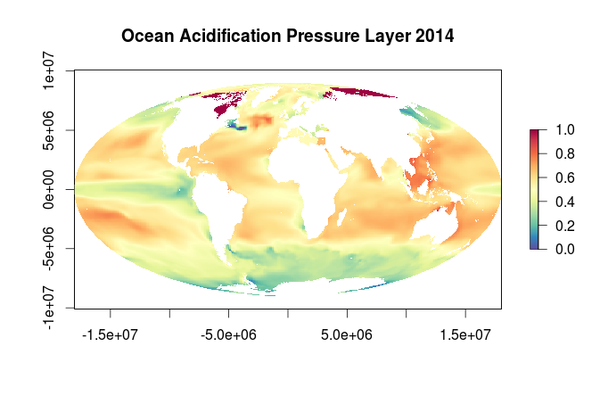
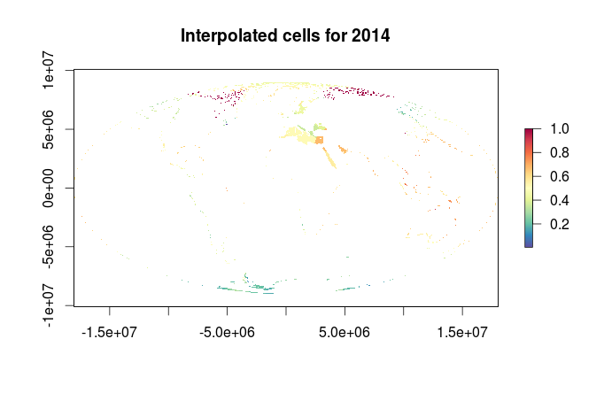

##Ocean Acidification Pressures Layer

Raw data provided by Ivan Lima from Woods Hole on December 16, 2014. This data is an updated to the work done by [Feely et a. (2009)](http://www.tos.org/oceanography/archive/22-4_feely.pdf).  

Monthly aragonite saturation state data provided for years 1880-1889 and 2005-2014 in NetCDF format with a resolution of about 1 degree.

####Procedure

**1. `oa_dataprep.r` turns NetCDF raw files into .tifs and has 2 functions:**  

    1. calculates average annual aragonite saturation state for each year    
    2. calculates the average decadal saturation state    
    
    
  Mean aragonite saturation state globally for 2014
  
  
  
**2. `create_global_oa_pressures_layer.R` does the following:**  

    1. Takes each of the 10 raster layers produced in (b) above, and subtracts the historical global mean (produced in step 1) 
       to create 10 new raster layers (one for each year) with values equal to the change in aragonite saturation state
    2. RESCALE: For each year between 2005 and 2014, look at the mean annual aragonite saturation state rasters (annualmean_2005-2014). 
       All values at or below the threshold (<=1) are set to 1 (highest pressure value). All cells with aragonite saturation state values >1 
       will be scaled based on their change relative to historical levels (calculated in step 2 above). All cells that have a negative change 
       (indicating a decrease in acidification) are assigned 0    
    3. Resamples each raster to 1km
    4. Using ArcGIS through arcpy in python, NA cells are interpolated using nearest neighbor to create final output raster layer

**Final output layer for 2014:**

  

    
**All NA cells interpolated for final layer:**
  
  

 
 

Cite as: Woods Hole Oceanographic Institution. 2014 update to data originally published in: Feely, R.A., S.C. Doney, and
S.R. Cooley. 2009. Ocean acidification: Present conditions and future changes in a high-CO2 world.
Oceanography 22(4):36–47
