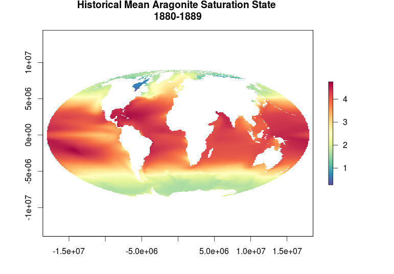

##Ocean Acidification Pressures Layer

Raw data provided by Woods Hole on December 16, 2014. This data is an update to the work done by [Feely et al. (2009)](http://www.tos.org/oceanography/archive/22-4_feely.pdf).  

Monthly aragonite saturation state data provided for years 1880-1889 and 2005-2014 in NetCDF format with a resolution of about 1 degree.

####Procedure Overview

For each year in the dataset provided, an average annual aragonite saturation state layer was created. Using these annual averages, a     decadal average for both 1880-1889 and 2005-2014 was calculated.
    
  **Mean aragonite saturation state globally for 2014**
  
  
  
  
The change in aragonite saturation state was calculated for each year from 2005-2014 by subtracting the historical global mean. 

  **Historical global mean of aragonite saturation 1880-1889**
  
  
  
  
Values at or below an aragonite saturation state of 1 were set equal to 1 in the final pressure layer (the highest possible value). This threshold was chosen based on expert consensus that once undersaturation is reached (<=1), dissolution of CaCO3 occurs and negatively impacts biological processes including calcification. All values greater than 1 are then rescaled according to the amount of change since the 1880s.

  
For OHI 2015, change in aragonite saturation state for 2011-2014 were included as a pressure. Below is an example of the final data used for 2014.

  

    
**All cells interpolated :**
  
  

 
Data Citation: Woods Hole Oceanographic Institution. 2014 update to data originally published in: Feely, R.A., S.C. Doney, and
S.R. Cooley. 2009. Ocean acidification: Present conditions and future changes in a high-CO2 world.
Oceanography 22(4):36–47
