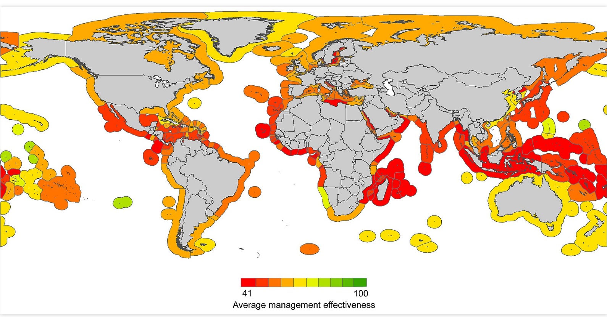

# README

**Data from Mora et al. 2009 are used for global Ocean Health Index assessments as two resilience measures.** These data are located in [resilience_mora/v2013/data](https://github.com/OHI-Science/ohiprep/tree/master/globalprep/resilience_mora/v2013/data) and can be downloaded individually by clicking on the filename (see below) and clicking 'raw' in the upper right corner of the file.

[Mora et al. 2009. Management Effectiveness of the World's Marine Fisheries. PLOS Biology.](http://journals.plos.org/plosbiology/article?id=10.1371/journal.pbio.1000131)

### 1. fisheries management effectiveness

Data from from Mora et al. 2009, filename = `r_mora_2013a.csv`. 

Description from Halpern et al. 2012, Supplemental Information, p. 41.

"These data come from Mora et al. [2009], and assess the current effectiveness of fisheries management regimes along 6 axes: Scientific Robustness, Policy Transparency, Implementation Capacity, Subsidies, Fishing Effort, and Foreign Fishing. All countries with coastal areas were assessed through a combination of surveys, empirical data and enquiries to fisheries experts. For each OHI reporting region, scores for each category were rescaled between 0 and 1 using the maximum possible value for each category and then the average score of all 6 categories combined was recorded as the overall Fisheries management effectiveness score."

### 2. artisanal and recreational fisheries 

Data from from Mora et al. 2009 supplementary figure S4. filename = `r_mora_s4_2013a.csv`. 

Description from Halpern et al. 2012, Supplemental Information, p. 19

"To assess the opportunity or ability to meet this demand, we used data from Mora et al. [2009], which scores countries on the institutional measures that support or facilitate artisanal and small-scale fishing. The data come from Figure S4 in Mora et al. [2009; see screenshot below], which is based on two survey questions focused on recreational and artisanal fishing (see Table S5 below for questions) and are on a scale from 0 to 100 (which we then rescale 0-1), where higher scores indicate better management. We extracted the data from the color codes on the map in Figure S4. There may be some small errors far a few countries due to difficulty of distinguishing between the two red colors at the lowest end of the scale."

**Mora et al 2009, figS4.**

**Table S5. Questions from Mora et al. [2009] that were used to evaluate access to artisanal scale fishing.**
 
If recreational fishing exists to any extent, which of the following apply:

- Are recreational fishermen required to have a fishing license? Y/N
- Are there regulations to the size of fish caught? Y/N
- Are there regulations to the number of fish caught? Y/N
- Are there regulations to the number of fishermen allowed to fish? Y/N
- Are there statistics being collected for this sort of fishing? Y/N

If artisanal fishing exists to any extent, which of the following apply?
- Are there regulations to the size of fish caught? Y/N
- Are there regulations to the number of fish caught? Y/N
- Are there regulations to the number of fishermen allowed to fish? Y/N
- Are there statistics being collected for this sort of fishing? Y/N