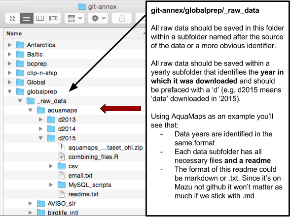

## Instructions for how to migrate to and work on Mazu

Each of us will be responsible for updating folders on both git-annex/globalprep/ohiprep and github.com/ohi-science/ohiprep/globalprep that we are most familiar with. The following gives instructions for what to do with each of these folders/goals/OHI components.

### First Step: Organize the raw data relevant to your pieces on Mazu.

### Second: Reorganize globalprep on GitHub

On github.com/ohiscience/ohiprep/globalprep:

1. **Rename goal/component folder** according to the target not the data source. Something like globalprep/tr for what is currently globalprep/TourismRecreation. These should closely follow the targets column in layers_eez.csv. This will be a work in progress, e.g. figuring out how to name folders for pressures/resilience, or when grouping multiple similar targets
+ This may involve combining folders that are currently separate in ohiprep
+ Create a new readme if there isn’t one
+ If there is one, make it look like the template (TO DO STILL, include citation policy - let’s make one for spp_ico and point to that)
2. **Use year-specific folders** to organize output by assessment year (v2015, v2016)
+ Each of these should have a readme.md (see template, or OA one) 
+ Each should have a data_prep.R, or .Rmd, well-commented and well-documented.
3. **Folder organization** within each year-specific folder:
+ `raw` is for 'raw-ish' type files that would not be on the server. This is more for piecemeal raw data gathered from many places than a single dataset downloaded or emailed to use.
+ `int` for intermediate files (previously we’ve used tmp, working, or other naming conventions)
+ `output` for the final data layer that is used in the OHI toolbox

