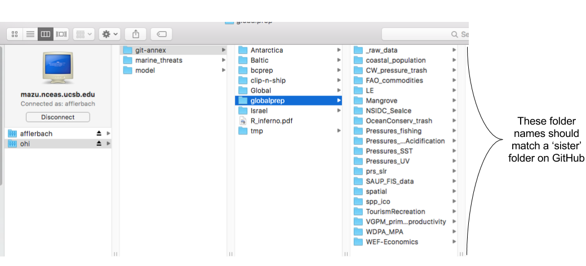

## Instructions for how to migrate to and work on Mazu

Each of us will be responsible for updating folders on both git-annex/globalprep/ohiprep and github.com/ohi-science/ohiprep/globalprep that we are most familiar with. The following gives instructions for what to do with each of these folders/goals/OHI components.

### First Step: Organize the raw data relevant to your pieces on Mazu.

#### README.md for raw data

Every raw data folder should have a README.md (try to keep the caps so it is consistent and easy to see). *Note we are using .md rather than .txt even for README on Mazu. 

Each README should include the following:

* Detailed source information. For example:
    + full paper citation and link for publication
    + Link to online data source
    + Full email history with data provider 
* If it was downloaded online, provided written and visual instructions so that the reader can mimic your same steps to get the same data. Include screenshots if possible!
* Version information for data
* Years included in the datatset
* Year the data was published
* Type of data included in the dataset (e.g. catch per species (tons) per country)
* Any other information that could possibly be useful to anyone
  

***

### Second: Reorganize globalprep on GitHub

On github.com/ohiscience/ohiprep/globalprep:

1. **Rename goal/component folder** according to the target not the data source. Something like globalprep/tr for what is currently globalprep/TourismRecreation. These should closely follow the targets column in layers_eez.csv. This will be a work in progress, e.g. figuring out how to name folders for pressures/resilience, or when grouping multiple similar targets. This may involve combining folders that are currently separate in ohiprep  
    + *README.md*: Make one if there isn't one already. If there is, make sure it looks like the [template](https://github.com/OHI-Science/ohiprep/blob/master/src/templates/generic_readme.md)
2. **Use year-specific folders** to organize output by assessment year (v2015, v2016)  
    + Each of these should have a README.md (see [this template](https://github.com/OHI-Science/ohiprep/blob/master/src/templates/generic_raw_data_README.md))   
    + Each should have a data_prep.R, or .Rmd, well-commented and well-documented. [Here is the dataprep template](https://github.com/OHI-Science/ohiprep/blob/master/src/templates/generic_data_prep.Rmd). 
3. **Folder organization** within each year-specific folder:  
    + `raw` is for 'raw-ish' type files that would not be on the server. This is more for piecemeal raw data gathered from many places than a single dataset downloaded or emailed to use.
    + `int` for intermediate files (previously we’ve used tmp, working, or other naming conventions)
    + `output` for the final data layer that is used in the OHI toolbox

***

### Third: Reorganize globalprep on Mazu

Our goal is to have everything stored on GitHub, but there are some files that are too large or inappropriate for GitHub and must be stored on Mazu. Each of these files should be stored in a similar manner to GitHub. If there is a need to make a duplicate folder on `git-annex`, it should have the same name as GitHub.

Store any intermediate or final output files that are too large for github in these folders. Keep the same subfolder structure. If you are working in `spp_ico` and have temporary rasters to store on Mazu, save them in a folder named `int`. If there is output held here, it should be stored in a folder called `output`.

**Raw data should not be stored here. This should be stored in the `_raw_data` folder**

